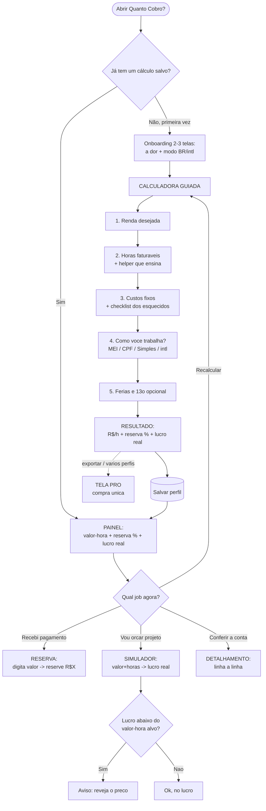

# QUANTO COBRO? — Blueprint de UX

> **Agente 2 · Arquitetura da Informação, UX, Telas, Funcionamento e Usabilidade**
> Escopo: SOMENTE UX. Sem Design System, sem cores, sem identidade visual. Foco em estrutura, fluxo, comportamento e usabilidade.
> App: **Quanto Cobro?** — calculadora financeira do freelancer: valor-hora justo, reserva de imposto e lucro real, com contexto tributário brasileiro (MEI/DAS · autônomo CPF · Simples) + modo internacional.

---

## 0. TL;DR — a tese de UX

O concorrente "raso" é uma **calculadora genérica de 1 campo**: você digita um número e ela cospe outro, sem contexto. O nosso valor **não está na conta** (a fórmula é pública) — está em **tornar visível o que o freelancer não vê** e **traduzir o caos tributário brasileiro em uma pergunta que ele sabe responder**.

A dor real são dois erros gêmeos: **cobrar de menos** (ignora custos invisíveis — horas não faturáveis, férias/13º, ferramentas) e **não reservar para imposto** (toma um susto quando o DAS/IR chega). A UX existe para matar os dois.

Toda decisão deste documento serve a **5 verdades do contexto**:

1. **A conta dá angústia** → o app guia passo a passo, nunca joga uma planilha na cara. Uma pergunta por vez.
2. **O custo invisível precisa ficar visível** → o app *mostra* o que o usuário esqueceu (horas não faturáveis, férias, ferramentas), em vez de assumir que ele já sabe.
3. **Imposto brasileiro é um labirinto** → o usuário não escolhe "regime tributário"; ele responde **"como você trabalha hoje?"** em português de gente. O app faz o mapeamento.
4. **Dois ritmos de uso** → calcular o valor-hora é **raro** (estratégico); reservar imposto e orçar projeto é **recorrente** (operacional). O app serve os dois — e o recorrente é o motor de retenção.
5. **É planejamento, não declaração** → números são **estimativas para decidir preço**, nunca consultoria fiscal. Honestidade calma, sem assustar.

Se o app só "fizer a conta", ele empata com a calculadora genérica. Ele ganha quando **mostra o invisível, fala a língua do MEI×CPF×Simples e vira hábito a cada pagamento.**

---

## 0.1 Atualização pós-pesquisa — VALIDADA (2026-07-18)

> Este blueprint foi confrontado com **pesquisa real** (16.961 reviews de concorrentes
> categorizados + sizing de mercado + voz do freelancer). A tese central se sustentou; o que
> muda é **ênfase**, não estrutura. Detalhe em [`planning/`](planning/README.md) e
> [`research/`](research/ANALISE-QUANTITATIVA-REVIEWS.md). Decisões abaixo estão **aprovadas**.

**A virada (ajuste de ênfase, nada é descartado):**
1. **"A Divisão" é o coração do produto**, não só um recurso visual. O app é "mostrar pra onde
   vai cada real que você recebe" — a calculadora de valor-hora vira **setup estratégico** (raro),
   não a função-título.
2. **A Reserva por pagamento é o caminho de ouro** (uso recorrente = motor de hábito). No Painel,
   a Divisão + "Recebi um pagamento" ganham peso ≥ ao card do valor-hora. *Ajusta §5.1 e §4.2.*
3. **Alcance ampliado:** o modelo antigo retinha bem só o iniciante (job raro). A virada pega o
   **freela em atividade**, o **recém-MEI** e o **freela pra gringo** (USD/carnê-leão) — ver
   [personas](planning/02-PERSONAS-E-JOBS.md).

**Ajustes por evidência (o que enxugar / estender):**
- ➕ **Backup/restore** e **exportar PDF** sobem de prioridade (pedidos recorrentes reais). Backup
  é grátis (confiança); PDF é âncora de Pro. *Adiciona ao §13 MVP e §11.*
- ➕ **Alíquota efetiva visível**, **modificadores de preço** (urgência/cliente difícil) e
  **histórico de reservas** entram no roadmap (v2). *Estende §13.*
- 🔧 O diferencial **não é profundidade de cálculo** — é leveza + confiança + o job do imposto.
  Estabilidade e transparência de preço viram **requisitos de produto**, não detalhes.
- 🔧 **Monetização (ajusta §11):** ads sozinho não sustenta no BR (rende centavos). Modelo passa a
  **freemium híbrido transparente** — núcleo grátis + Pro que o usuário escolhe (**vitalício
  ~R$129-149 OU anual ~R$89,90**), cálculo básico sempre grátis. O mercado odeia assinatura
  **escondida**, não assinatura. Ver [05](planning/05-ESCOPO-E-ROADMAP.md).

**Regras da casa reforçadas por dado (anti-★1, 31% das queixas do mercado):** não travar ·
nunca cobrar escondido · rodar **sem login/cadastro** · não imitar app do governo · nunca dar
número fiscal errado · anúncio nunca sobre número. Ver [04](planning/04-DIFERENCIAIS-E-REGRAS.md).

**Fundação técnica (validada):** Flutter (Android+iOS), **local-first, 100% offline, SEM login**,
Riverpod + Drift + go_router, `in_app_purchase` + AdMob. Ver [06](planning/06-FUNDACAO-TECNICA.md).

---

## 1. Contexto, público e a verdade incômoda

**Público-alvo real:**
- Autônomos e freelancers brasileiros que **precificam "no chute"** — dos ~25,5 mi de trabalhadores por conta própria, só ~25,7% têm CNPJ. A maioria não tem ideia do próprio custo-hora.
- Quem está **começando a formalizar** (virou MEI, abriu Simples) e descobriu que precisa reservar imposto — e se assustou.
- Profissionais de serviço (design, dev, redação, fotografia, consultoria, beleza, etc.) que vendem **tempo** e cobram por hora/projeto.

**Implicação de UX:** o usuário-alvo **não é financeiramente fluente** e chega **ansioso** ("será que tô cobrando errado a vida toda?"). A UX não pode parecer uma declaração de imposto de renda. Tem que parecer uma **conversa que resolve**: pergunta clara → resposta clara → "ah, agora entendi".

**A verdade incômoda:** a fórmula não é segredo (reservar 25–30%, valor-hora = (renda + custos + impostos) ÷ horas faturáveis). Existem dezenas de calculadoras. **O que ninguém faz bem é o contexto BR + a didática.** É aí que a UX precisa ganhar: na **pergunta certa, no momento certo, em português que o autônomo entende** — e em ser uma ferramenta de **bolso, offline, recorrente**, não uma planilha web que você abre uma vez e esquece.

**Restrição honesta (e de UX):** alíquotas (DAS, faixas do Simples, IRPF/INSS) mudam e variam por caso. O app **não pode se vender como exato**. A UX precisa entregar um número **confiável o bastante para decidir preço** e, ao mesmo tempo, deixar claro que é **estimativa de planejamento**. Esse equilíbrio — útil sem ser irresponsável — é uma decisão de UX, não um rodapé jurídico.

---

## 2. Jobs To Be Done & cenários

**JTBD primários**
- *"Quando vou fechar um trabalho, quero saber quanto cobrar por hora pra de fato pagar minhas contas e sobrar lucro — sem descobrir tarde demais que trabalhei de graça."*
- *"Quando recebo um pagamento, quero saber na hora quanto guardar pro imposto, pra não gastar o que não é meu."*
- *"Quando me mandam um valor de projeto, quero saber se aquilo me dá lucro de verdade depois de custos e impostos."*

**Os três jobs mapeiam direto nas três ferramentas do app:**

| Job | Ferramenta | Ritmo |
|---|---|---|
| Quanto cobrar por hora | **Calculadora de valor-hora** (estratégica) | Raro — revisita a cada poucos meses |
| Quanto reservar de imposto | **Reserva por pagamento** (operacional) | Recorrente — a cada recebimento |
| Lucro real do projeto | **Simulador de projeto** (operacional) | Recorrente — a cada orçamento |

**Cenários de uso**
| Cenário | Necessidade dominante de UX |
|---|---|
| Recém-virou freelancer, não faz ideia do valor-hora | Onboarding didático; calculadora guiada que *ensina* o custo invisível |
| Vai mandar proposta hoje | Resposta rápida e confiável; "cobre R$X/h" + simulador do projeto |
| Acabou de receber R$2.000 | Tool de 1 campo: "reserve R$320"; em 5 segundos |
| Virou MEI / abriu Simples | Trocar regime e ver a reserva mudar; entender o impacto |
| Trabalha pra cliente gringo | Modo internacional (reservar 25–30%, moeda) |
| Compara preço entre 2 tipos de cliente | Vários perfis (Pro) — "cliente recorrente" × "projeto avulso" |

---

## 3. Princípios de UX (norteadores de decisão)

1. **Uma pergunta por vez** — a conta angustiante vira um passo a passo digerível. Nunca uma planilha de campos.
2. **Mostrar o invisível** — o app revela custos que o usuário esquece (horas não faturáveis, férias/13º, ferramentas). Educar é o produto, não enfeite.
3. **Falar humano, não fiscal** — o usuário responde como trabalha; o app traduz para regime/alíquota nos bastidores. Zero jargão obrigatório.
4. **Confiável o bastante pra decidir, honesto sobre o limite** — número credível + selo calmo de "estimativa de planejamento". Nunca finge ser declaração.
5. **Defaults inteligentes** — todo campo difícil já vem com um chute razoável (ex.: ~1.300h faturáveis/ano), que o usuário ajusta se quiser. Ninguém trava por não saber um número.
6. **O recorrente é rei** — reservar imposto e orçar projeto têm que ser instantâneos (≤2 toques a partir da Home). É o que traz o usuário de volta.
7. **Transparência da conta** — sempre dá pra ver "como cheguei nesse número". Caixa-preta destrói confiança em app de dinheiro.
8. **Local-first e privado** — dados de renda são sensíveis; tudo fica no aparelho, sem cadastro. Isso é também um argumento de confiança.

---

## 4. Arquitetura da Informação

### 4.1 Modelo de entidades (conceitual)

- **Perfil de cálculo** (no MVP: 1; no Pro: vários — "cliente A", "projeto avulso"…)
  - nome do perfil (Pro)
  - renda desejada (líquida, por mês — ou ano)
  - horas faturáveis (por mês/ano) — *o campo que mais ensina*
  - lista de **custos fixos**
  - **regime** associado
  - reserva de férias/13º (provisão opcional)
  - moeda / modo (BR × internacional)
- **Custo fixo**
  - nome (ex.: "Adobe", "Internet", "Coworking")
  - valor mensal
  - categoria (ferramenta · equipamento · espaço · outro) — para sugerir os esquecidos
- **Regime tributário** (dado local, atualizado ~1×/ano)
  - tipo: `MEI` · `Autônomo (CPF)` · `Simples Nacional` · `Internacional`
  - parâmetros: DAS fixo, faixa/anexo, % efetivo estimado, INSS, ano da tabela
- **Resultado** (derivado, nunca digitado)
  - valor-hora · valor-dia · % de reserva · lucro real estimado
- **Pagamento recebido** (efêmero — alimenta o tool de reserva)
  - valor recebido → valor a reservar → sobra
- **Simulação de projeto** (efêmera — alimenta o simulador)
  - valor do projeto · horas estimadas · custos do projeto → lucro real · valor-hora efetivo
- **Configurações globais**
  - moeda · modo BR/internacional · ano das tabelas · restaurar/limpar dados

> **A decisão central de IA é separar o ESTRATÉGICO do OPERACIONAL.** O *Perfil* (permanente, calculado de vez em quando) alimenta de defaults os dois tools *efêmeros* (reserva e simulação, usados toda hora). Isso transforma "refazer a conta" em "tocar uma vez" — o equivalente, aqui, ao que os presets eram no Fervura.

### 4.2 Mapa de navegação (sitemap)

```
┌──────────────────────────────────────────────────────────────┐
│  PAINEL (Home)  ← tela-estrela: mostra as 3 respostas          │
│   ├─ Recalcular valor-hora ─────►  CALCULADORA GUIADA (5 passos)│
│   │                                  └─ Resultado ─► salvar perfil│
│   ├─ "Recebi um pagamento" ─────►  RESERVA (tool rápido)        │
│   ├─ "Vou orçar um projeto" ────►  SIMULADOR DE PROJETO (tool)  │
│   ├─ "Ver como cheguei" ────────►  DETALHAMENTO DO CÁLCULO      │
│   ├─ Perfis (Pro) ──────────────►  LISTA DE PERFIS              │
│   └─ Ajustes ───────────────────►  CONFIGURAÇÕES               │
│                                                                │
│  [Primeira vez]      ───────────►  ONBOARDING (2–3 telas)       │
│  [Gatilho de valor]  ───────────►  TELA PRO (compra única)      │
└──────────────────────────────────────────────────────────────┘
```

**Decisão de navegação — hub-and-spoke raso, centrado no Painel.** Tudo orbita uma tela. Sem abas profundas: em app utilitário, profundidade = fricção. O Painel **mostra as três respostas de relance** e dá os atalhos para os dois tools recorrentes. A calculadora longa é um **fluxo guiado** (satélite), não a casa.

> **Por que não uma bottom-nav de 3 abas?** Tentador (são 3 jobs), mas as três respostas **convivem na mesma tela** (Painel) e os dois tools operacionais são ações rápidas, não destinos onde você "mora". Uma navegação por hub mantém o app sentindo-se simples — coerente com o padrão 4YU (1 problema, escopo enxuto). *Trade-off registrado abaixo (§15).*

### 4.3 Fluxograma principal (base para Whimsical)

Fluxo de ponta a ponta — do abrir aos três jobs. Use como base para redesenhar no Whimsical.



**Leitura do fluxograma:** o **caminho de ouro de quem volta** é `Abrir → Painel → tool recorrente` (1–2 toques). A **calculadora guiada** é o investimento inicial (feito uma vez, revisitado raramente), e cada passo carrega um momento didático. O nó crítico de retenção é o `Painel`: se ele não mostrar valor de relance e os atalhos certos, o app vira "abri uma vez". O ramo `J1` (lucro abaixo do alvo) é o que **liga o operacional de volta ao estratégico** — o app não só calcula, ele **alerta**.

---

## 5. Inventário de telas

Para cada tela: **objetivo · elementos · estados · interações · porquê**. Wireframes de baixa fidelidade (estrutura, não estética).

### 5.1 Painel / Home ⭐

**Objetivo:** mostrar as três respostas de relance e dar atalho de 1 toque para os jobs recorrentes.

**Wireframe (com cálculo salvo):**
```
┌───────────────────────────────┐
│  Quanto Cobro?           [⚙]   │
│                                │
│  SEU VALOR-HORA                │
│  ┌──────────────────────────┐  │
│  │     R$ 92 / hora          │  │ ← herói
│  │  pra ganhar R$ 5.000/mês  │  │
│  │  [ ver como cheguei aqui ]│  │
│  └──────────────────────────┘  │
│                                │
│  ┌────────────┐ ┌────────────┐ │
│  │ 💰 Recebi um│ │ 📄 Vou orçar│ │ ← 2 tools
│  │  pagamento  │ │  um projeto │ │   recorrentes
│  └────────────┘ └────────────┘ │
│                                │
│  De cada pagamento, reserve    │
│  ┌──────────────────────────┐  │
│  │   ~16%  (regime: MEI)      │  │
│  └──────────────────────────┘  │
│                                │
│  Lucro real estimado: R$ 5.000 │
│  Custos cadastrados: R$ 850/mês│
│                                │
│        ╔══════════════╗        │
│        ║  Recalcular    ║       │
│        ╚══════════════╝        │
└───────────────────────────────┘
```

**Elementos:** card-herói do valor-hora · dois botões grandes para os tools recorrentes (reserva, simulador) · resumo da reserva % e do lucro real · acesso a "como cheguei" (detalhamento), Recalcular e Configurações.

**Por quê:** concentra as respostas dos 3 jobs e os 2 atalhos mais frequentes numa tela só. O valor-hora é o herói porque é a pergunta que mais dói; os tools logo abaixo porque são o que traz o usuário de volta.

**Estados:** sem cálculo (ver 5.8) · com cálculo · dado de regime desatualizado (faixa "tabela 2025" + aviso suave).

---

### 5.2 Calculadora guiada (fluxo de 5 passos) — o investimento inicial

**Objetivo:** chegar nas três respostas sem assustar — uma pergunta por tela, cada uma com um default e um momento de ensino.

**Princípio do fluxo:** *progressive disclosure*. O caminho free entrega um número credível com 5 passos curtos. O **modo avançado (Pro)** abre subcampos por regime — mas nunca é obrigatório para ter resposta.

**Passo 1 — Renda desejada**
```
┌───────────────────────────────┐
│  ← Passo 1 de 5      ●○○○○      │
│                                │
│  Quanto você quer GANHAR        │
│  por mês? (limpo, no bolso)     │
│                                │
│  ┌──────────────┐              │
│  │  R$ 5.000     │             │
│  └──────────────┘              │
│  ⓘ É o que você quer que sobre  │
│    pra você — não o faturamento.│
│                                │
│        ╔══════════════╗        │
│        ║   Continuar    ║       │
│        ╚══════════════╝        │
└───────────────────────────────┘
```

**Passo 2 — Horas faturáveis** *(o passo que mais ensina)*
```
┌───────────────────────────────┐
│  ← Passo 2 de 5      ●●○○○      │
│                                │
│  Quantas horas você realmente   │
│  FATURA por mês?                │
│                                │
│  ┌──────────────┐              │
│  │   110 h/mês   │             │
│  └──────────────┘              │
│  ⚠ Não são 160h. Tire férias,   │
│    feriados e o tempo SEM        │
│    cliente (vendas, e-mail,      │
│    estudo). Quase ninguém        │
│    fatura mais que ~70%.         │
│                                │
│  [ não sei → estimar pra mim ]  │
│                                │
│        ╔══════════════╗        │
│        ║   Continuar    ║       │
│        ╚══════════════╝        │
└───────────────────────────────┘
```

**Passo 3 — Custos fixos** *(tornar o invisível visível)*
```
┌───────────────────────────────┐
│  ← Passo 3 de 5      ●●●○○      │
│                                │
│  Seus custos pra trabalhar?     │
│                                │
│  ✓ Ferramentas/softwares  R$120│
│  ✓ Internet/telefone      R$100│
│  ✓ Equipamento (rateio)   R$150│
│  + adicionar custo              │
│                                │
│  Não esqueça:                   │
│  [Contador] [Coworking]         │ ← chips
│  [Cursos] [Energia] [Pró-labore]│   de lembrança
│                                │
│  Total: R$ 850/mês             │
│        ╔══════════════╗        │
│        ║   Continuar    ║       │
│        ╚══════════════╝        │
└───────────────────────────────┘
```

**Passo 4 — Como você trabalha?** *(regime em português de gente)*
```
┌───────────────────────────────┐
│  ← Passo 4 de 5      ●●●●○      │
│                                │
│  Como você recebe hoje?         │
│                                │
│  ◉ Sou MEI                      │
│    DAS fixo mensal, imposto baixo│
│  ○ Autônomo (pessoa física/CPF) │
│    Carnê-leão + INSS            │
│  ○ Tenho empresa no Simples     │
│    Alíquota por faixa           │
│  ○ Não sei / cliente no exterior│
│    Reserva padrão 25–30%        │
│                                │
│        ╔══════════════╗        │
│        ║   Continuar    ║       │
│        ╚══════════════╝        │
└───────────────────────────────┘
```

**Passo 5 — Férias e 13º (opcional)**
```
┌───────────────────────────────┐
│  ← Passo 5 de 5      ●●●●●      │
│                                │
│  Quer provisionar férias e 13º? │
│  (autônomo não ganha de graça)  │
│                                │
│  [ Sim, reservar 1 mês/ano ]    │
│  [ Agora não ]                  │
│                                │
│        ╔══════════════╗        │
│        ║   Ver resultado║       │
│        ╚══════════════╝        │
└───────────────────────────────┘
```

**Decisões-chave do fluxo:**
- **Renda "no bolso", não faturamento (Passo 1):** o usuário pensa em quanto quer *ganhar*, não em receita bruta. Pedir o conceito errado gera número errado.
- **Horas faturáveis é o coração didático (Passo 2):** é o erro nº1 ("trabalho 160h, logo divido por 160"). O aviso + o helper "estimar pra mim" são a maior alavanca de UX do app. O helper pergunta semanas de férias, feriados e % de tempo sem cliente, e devolve ~1.300h/ano.
- **Custos com checklist de lembrança (Passo 3):** chips dos custos *esquecidos* (contador, cursos, coworking) materializam o "custo invisível". É o que a calculadora genérica não faz.
- **Regime sem jargão (Passo 4):** rádio de 4 opções em linguagem de trabalho, cada uma com subtítulo de 1 linha. O mapeamento para alíquota acontece escondido.
- **Férias/13º opcional (Passo 5):** provisão que o CLT tem e o autônomo esquece. Opcional para não inflar o passo a passo de quem só quer o número rápido.

**Por quê:** o fluxo guiado é o que transforma "conta angustiante" em conversa. Cada passo ensina algo e já vem com default — ninguém trava.

---

### 5.3 Resultado

**Objetivo:** entregar as três respostas com hierarquia clara e um caminho para entender/confiar.

**Wireframe:**
```
┌───────────────────────────────┐
│  ← Seu resultado       [PDF*]  │ ← *Pro
│                                │
│  COBRE POR HORA                │
│  ┌──────────────────────────┐  │
│  │      R$ 92 / hora         │  │ ← herói
│  └──────────────────────────┘  │
│  ≈ R$ 736/dia · R$ 10,1k/mês   │
│    faturados                    │
│                                │
│  DE CADA PAGAMENTO, RESERVE    │
│  ┌──────────────────────────┐  │
│  │   16%   (~R$ por receb.)   │  │
│  └──────────────────────────┘  │
│                                │
│  LUCRO REAL ESTIMADO           │
│  ┌──────────────────────────┐  │
│  │   R$ 5.000 limpos/mês      │  │
│  └──────────────────────────┘  │
│                                │
│  [ ver detalhamento ▾ ]        │
│  [ salvar este perfil ]         │
│  ⚠ Estimativa de planejamento, │
│    não é consultoria fiscal.    │
└───────────────────────────────┘
```

**Elementos:** três blocos hierarquizados (valor-hora = herói; reserva % e lucro real = confirmação) · equivalências (dia/mês faturado) · acesso ao detalhamento · salvar perfil · selo de estimativa.

**Por quê:** as três respostas são a entrega-núcleo do produto. O valor-hora vem primeiro porque é a pergunta-mãe; reserva e lucro real **fecham a confiança** ("e o imposto? e o que sobra?"). O selo aparece aqui, calmo, no momento da entrega.

---

### 5.4 Detalhamento do cálculo ("como cheguei aqui")

**Objetivo:** abrir a caixa-preta — mostrar a conta linha a linha.

**Wireframe:**
```
┌───────────────────────────────┐
│  ← Como cheguei nesse número    │
│                                │
│  Renda desejada      R$ 5.000  │
│  + Custos fixos      R$   850  │
│  + Provisão férias/13º R$ 458  │
│  + Imposto estimado  R$   ...  │
│  ───────────────────────────── │
│  = Preciso faturar   R$ 10.1k  │
│  ÷ Horas faturáveis     110 h  │
│  ───────────────────────────── │
│  = Valor-hora        R$ 92/h   │
│                                │
│  [ editar qualquer item ]       │
└───────────────────────────────┘
```

**Por quê:** app de dinheiro sem transparência não gera confiança. Ver a conta — e poder editar um item ali mesmo — transforma o número de "palpite do app" em "minha decisão fundamentada".

---

### 5.5 Reserva por pagamento (tool recorrente) — motor de retenção

**Objetivo:** em 5 segundos, dizer quanto guardar de um pagamento que acabou de cair.

**Wireframe:**
```
┌───────────────────────────────┐
│  ← Recebi um pagamento         │
│                                │
│  Quanto você recebeu?           │
│  ┌──────────────┐              │
│  │  R$ 2.000     │             │
│  └──────────────┘              │
│                                │
│  RESERVE PARA IMPOSTO          │
│  ┌──────────────────────────┐  │
│  │   R$ 320   (16%)           │  │ ← herói
│  └──────────────────────────┘  │
│  Sobra pra usar: R$ 1.680      │
│                                │
│  Regime: MEI ▾  (puxa do perfil)│
└───────────────────────────────┘
```

**Elementos:** 1 campo (valor recebido) · resultado-herói (valor a reservar) · sobra · regime herdado do perfil (editável pontualmente).

**Por quê:** é o uso **recorrente** — toda vez que o freelancer recebe. Um tool de 1 campo que resolve uma ansiedade real ("isso é meu ou é do leão?") é o que faz o app virar hábito. Herdar o regime do perfil tira todo o atrito.

---

### 5.6 Simulador de projeto (tool recorrente)

**Objetivo:** dizer se um valor de projeto dá lucro real — e ligar de volta ao valor-hora alvo.

**Wireframe:**
```
┌───────────────────────────────┐
│  ← Vou orçar um projeto        │
│                                │
│  Valor do projeto               │
│  [ R$ 3.000 ]                  │
│  Horas estimadas                │
│  [ 30 h ]                       │
│  Custos do projeto (opcional)   │
│  [ R$ 200 ]                     │
│                                │
│  LUCRO REAL:  R$ 1.960          │ ← herói
│  Valor-hora efetivo: R$ 65/h    │
│                                │
│  ⚠ Abaixo do seu alvo (R$ 92/h).│
│    Você cobraria ~R$ 4.260      │
│    pra manter seu lucro.        │
└───────────────────────────────┘
```

**Elementos:** valor + horas + custos do projeto · lucro real (herói) · valor-hora efetivo · **aviso comparativo** quando fica abaixo do alvo, com sugestão de preço.

**Por quê:** este é o momento "antes de mandar a proposta". O **aviso comparativo** é o que diferencia de uma calculadora burra: o app não só calcula, ele **defende o usuário de aceitar trabalho ruim** — e mostra qual preço corrige.

---

### 5.7 Lista de Perfis (Pro)

**Objetivo:** alternar entre cenários de precificação (cliente recorrente × avulso × outro nicho).

**Wireframe:**
```
┌───────────────────────────────┐
│  ← Perfis              [+ novo]│
│                                │
│  ◉ Padrão           R$ 92/h    │
│  ○ Cliente recorrente R$ 78/h  │
│  ○ Projeto avulso    R$ 115/h  │
│                                │
│  ⓘ Vários perfis é recurso Pro.│
└───────────────────────────────┘
```

**Por quê:** preço real varia por tipo de cliente. Vários perfis é uma necessidade legítima de quem fatura sério — e por isso é um bom gancho de Pro (público profissional converte).

---

### 5.8 Estado vazio (primeiro uso, sem cálculo)

**Objetivo:** transformar o vazio em começar — sem assustar.

**Wireframe:**
```
┌───────────────────────────────┐
│  Quanto Cobro?           [⚙]   │
│                                │
│   Você provavelmente cobra      │
│   menos do que deveria.         │
│                                │
│   Descubra seu valor-hora       │
│   justo em 5 perguntas.         │
│                                │
│        ╔══════════════╗        │
│        ║  Começar       ║       │
│        ╚══════════════╝        │
│                                │
│   Leva 2 minutos · 100% offline │
└───────────────────────────────┘
```

**Por quê:** o primeiro uso define a percepção. A copy fisga a dor ("cobra menos do que deveria"), promete pouco esforço ("5 perguntas, 2 minutos") e reforça privacidade ("offline"). Um único CTA, sem ruído.

---

## 5.9 Matriz de estados — vazio · loading · erro

Regra do Agente 2: nenhuma tela vive só no "caminho feliz". App local-first → *loading* é quase inexistente; o que importa aqui são **validação de input** e **dado tributário desatualizado**.

| Tela | Vazio | Loading | Erro |
|---|---|---|---|
| **Painel** | "Você provavelmente cobra menos…" + Começar (§5.8) | Instantâneo (lê do aparelho) | Falha ao ler perfil salvo → "não consegui carregar seu cálculo, refaça" + Começar |
| **Calculadora — Renda** | Campo vazio → "Continuar" inativo | n/a | R$ 0 ou negativo → "Continuar" inativo + dica |
| **Calculadora — Horas** | Vazio → assume default (~110h) com aviso "ajuste se quiser" | n/a | 0h → bloqueia (divisão por zero) com explicação humana |
| **Calculadora — Custos** | Lista vazia permitida → total R$ 0 (ok) | n/a | Valor não numérico → ignora linha + aviso |
| **Calculadora — Regime** | Nenhum selecionado → default "Não sei (25–30%)" | n/a | Tabela do ano indisponível → cai no % internacional + aviso |
| **Resultado** | n/a (só existe pós-cálculo) | Cálculo instantâneo | Input impossível (ex.: custos > faturamento viável) → mostra resultado + alerta "seu custo é maior que sua meta; reveja" |
| **Reserva (tool)** | Campo vazio → sem resultado ainda | n/a | Sem regime definido → pede pra escolher um (ou usa internacional) |
| **Simulador** | Campos vazios → sem resultado | n/a | Horas = 0 → não calcula valor-hora efetivo + dica |
| **Perfis (Pro)** | Só "Padrão" → convite a criar | n/a | Falha ao salvar → snackbar "não salvou, tente de novo" + desfazer |
| **Configurações** | n/a | n/a | Reset de dados → confirmação dupla (ação destrutiva) |

**Estados globais (transversais — os que mais importam aqui):**
- **Dado tributário desatualizado:** quando o ano das tabelas embutidas é anterior ao ano corrente, mostrar faixa discreta "valores base de [ano]; confirme alíquotas atuais" — honestidade sobre o limite, sem alarme.
- **Selo de estimativa onipresente:** toda tela que mostra número de imposto carrega o lembrete calmo "estimativa de planejamento". Nunca some, nunca grita.
- **Input incoerente:** o app sempre devolve *algum* resultado + um alerta orientador, em vez de travar — o usuário aprendeu algo mesmo num cenário extremo.

---

## 6. Fluxos principais (passo a passo)

**F1 — Descobrir o valor-hora (caminho do investimento inicial)**
`Painel vazio → Começar → renda → horas (+helper) → custos (+lembretes) → regime → férias → Resultado → salvar perfil.` (5 passos curtos)

**F2 — Reservar imposto de um pagamento (caminho de ouro recorrente)**
`Painel → "Recebi um pagamento" → digita R$ recebido → vê quanto reservar.` (2 toques)

**F3 — Avaliar um projeto antes de orçar**
`Painel → "Vou orçar um projeto" → valor + horas → lucro real + aviso se abaixo do alvo.`

**F4 — Entender/ajustar a conta**
`Painel → "ver como cheguei" → detalhamento linha a linha → editar item → recalcula na hora.`

**F5 — Trocar de cenário (Pro)**
`Painel → Perfis → seleciona "Projeto avulso" → Painel reflete o novo valor-hora.`

**F6 — Mudar de regime (ex.: virou MEI)**
`Configurações ou Recalcular → Passo 4 → troca regime → reserva % e lucro real se ajustam.`

---

## 7. Deep dive — o motor didático (horas faturáveis & regime)

Os dois subsistemas onde a UX realmente ganha (ou perde):

**7.1 Horas faturáveis — o "helper que estima pra mim"**
- O erro nº1 do freelancer: dividir a renda por 160h/mês. A realidade é ~70% disso ou menos (férias, feriados, doença, e todo o tempo **sem cliente**: prospecção, propostas, e-mail, estudo, refação).
- **UX:** o campo já vem com um default honesto (~110h/mês ≈ 1.300h/ano) e um aviso curto. Quem não sabe toca **"estimar pra mim"** e responde 3 perguntas simples (semanas de férias/ano · % do tempo que é trabalho pago · feriados) → o app devolve o número.
- **Por que importa:** é o insumo que mais muda o resultado. Errar aqui é cobrar 30–40% a menos. Acertar aqui, sozinho, já justifica o app.

**7.2 Regime tributário — "como você trabalha?" → alíquota nos bastidores**
- O usuário **nunca** escolhe "Anexo III" ou "carnê-leão". Ele escolhe como recebe; o app mapeia:
  - **MEI** → DAS fixo mensal (impacto baixo, quase fixo) + alerta de teto de faturamento.
  - **Autônomo (CPF)** → estimativa de IRPF (carnê-leão, progressivo) + INSS.
  - **Simples Nacional** → % por faixa/anexo (serviços).
  - **Não sei / internacional** → regra-padrão 25–30%.
- **Modo avançado (Pro):** abre os subcampos reais (faixa do Simples, alíquota INSS 11%/20%, deduções) para quem quer precisão.
- **Honestidade obrigatória (UX + compliance):** os percentuais são **estimativas**. ⚠️ As tabelas (DAS, faixas do Simples, IRPF/INSS) **precisam ser validadas nas fontes oficiais da Receita antes de publicar** e revisadas ~1×/ano. A copy nunca diz "você deve X de imposto"; diz "estime reservar ~X% para imposto". É planejamento, não declaração.

---

## 8. Privacidade & confiança (crítico em app de dinheiro)

Dados de renda são sensíveis — e isso é, ao mesmo tempo, risco e argumento de venda:
- **100% offline / local-first:** nada de renda, custo ou imposto sai do aparelho. Sem cadastro, sem login, sem nuvem. Dito de forma simples no onboarding e no estado vazio ("100% offline").
- **Sem pedir o que não precisa:** o app não precisa de conta, e-mail ou permissões sensíveis. Quanto menos pede, mais confiável parece.
- **Reset fácil:** "apagar meus dados" acessível em Configurações, com confirmação — o usuário sente que está no controle.
- **Transparência da conta (§5.4):** ver a fórmula é parte da confiança. Caixa-preta + dinheiro = desinstalação.

---

## 9. Acessibilidade & ergonomia

- **Teclado numérico nativo** nos campos de valor; formatação de moeda automática (R$, separadores) para evitar erro de digitação.
- **Rótulos claros e curtos**, sem jargão fiscal; cada termo difícil tem um "ⓘ" com 1 frase em português simples.
- **Alvos de toque generosos** (≥48dp); um campo e um botão por foco no fluxo guiado.
- **Número-herói legível**: o resultado de cada tela é sempre o maior elemento.
- **Não depender de cor** para significado (ex.: o aviso "abaixo do alvo" tem ícone + texto, não só cor).
- **Leitura por TalkBack/leitor de tela** em campos e resultados; ordem de leitura lógica (pergunta → campo → resultado).
- **Microcopy de erro humana**: "Coloque um valor maior que zero pra eu calcular" em vez de "input inválido".

---

## 10. Microinterações & prevenção de erro

- **Defaults sempre presentes:** nenhum passo trava por o usuário "não saber" — há um chute razoável editável.
- **Resultado ao vivo** nos tools (reserva, simulador): muda enquanto digita, sem botão "calcular".
- **Editar do detalhamento:** mexeu num item → recalcula na hora, sem refazer o fluxo todo.
- **Confirmar ações destrutivas:** apagar perfil / resetar dados pede confirmação + desfazer.
- **Aviso comparativo no simulador:** alerta proativo quando o projeto fica abaixo do valor-hora alvo — o app cuida do usuário.
- **Progresso visível** no fluxo guiado (●●○○○) — reduz a ansiedade de "quanto falta".

---

## 11. UX de monetização (sem entrar em DS)

Modelo: **AdMob (banner)** + **Pro de compra única** (vários perfis, exportar orçamento em PDF, modo avançado por regime, remover anúncios). Do ponto de vista de **usabilidade**:

- **Onde o anúncio NUNCA pode estar:** sobre o resultado, dentro do fluxo de cálculo, ou na tela de reserva/simulador no momento da resposta. Anúncio cobrindo um número de dinheiro = quebra de confiança = desinstalação.
- **Onde pode estar (com parcimônia):** banner discreto no rodapé do Painel quando há espaço; intersticial só em **momento calmo** (ex.: ao voltar pro Painel depois de fechar um resultado — nunca durante a digitação).
- **Gatilhos de Pro (no momento de valor, não de aflição):** ao tocar "exportar PDF", ao tentar criar um 2º perfil, ou ao abrir "modo avançado". O público é profissional e converte quando vê utilidade concreta — a oferta aparece **onde o recurso seria usado**, não como pop-up aleatório.
- **PDF de orçamento (Pro):** é o recurso com maior cara de "ferramenta de trabalho" — transformar o cálculo num orçamento apresentável ao cliente. Forte âncora de conversão.

> Princípio: anúncio jamais compete com a função-núcleo (ver o número, reservar, decidir preço). Pro se vende sendo útil, não sendo intrusivo.

---

## 12. Sinais de sucesso de UX (leves)

Foco não é métrica pesada; poucos sinais acionáveis:
- **Conclusão do fluxo guiado** (% que chega ao Resultado) — se cai num passo, esse passo está confuso (provável suspeito: horas faturáveis).
- **Uso do tool de reserva por usuário/mês** (proxy de hábito/retenção — o coração recorrente).
- **% que usa "estimar pra mim"** nas horas (mede se o conceito difícil está sendo resolvido).
- **Recálculos ao longo do tempo** (usuário voltou porque mudou de regime/renda = engajamento saudável).
- **Conversão Pro a partir de cada gatilho** (PDF × 2º perfil × avançado) — qual recurso puxa a compra.

---

## 13. Escopo: MVP × v2 × futuro

**MVP / v1 (o que faz o app valer a pena)**
- Calculadora guiada de 5 passos → as **3 respostas** (valor-hora, reserva %, lucro real).
- Helper "estimar pra mim" das horas faturáveis (a maior alavanca didática).
- Checklist de custos invisíveis.
- Regimes BR (MEI · CPF · Simples) + modo internacional, em linguagem humana.
- Tool de **reserva por pagamento** e **simulador de projeto** (com aviso comparativo).
- Detalhamento "como cheguei" + edição inline.
- 1 perfil, 100% offline, banner AdMob.

**v2 / Pro**
- **Vários perfis** (cliente/projeto).
- **Exportar orçamento em PDF**.
- **Modo avançado por regime** (faixas do Simples, INSS 11/20%, deduções).
- Remover anúncios.

**Futuro**
- Histórico de reservas (acompanhar o quanto já guardou no mês).
- Lembrete de "guardar a reserva" após registrar um recebimento.
- Comparador "antes × depois" (quanto eu cobrava × quanto deveria).
- Categorias por profissão com defaults de custo.

---

## 14. Riscos de UX & questões em aberto

**Riscos**
- **Parecer complexo demais (afasta o iniciante):** se o fluxo soar como imposto de renda, o ansioso desiste. → mitigação: uma pergunta por tela, defaults, linguagem humana, "5 perguntas, 2 minutos".
- **Parecer simples/genérico demais (vira a calculadora rasa):** se não mostrar o contexto BR e o custo invisível, empata com o concorrente. → mitigação: regime em PT-BR + checklist de custos + helper de horas.
- **Imprecisão tributária gerando confiança falsa:** usuário tomar o número como declaração. → mitigação: selo de "estimativa de planejamento" onipresente + validação das tabelas na Receita antes de publicar + copy que nunca afirma valor devido.
- **App de "abrir uma vez":** se o estratégico não puxar o recorrente, morre. → mitigação: os dois tools operacionais (reserva/simulador) como protagonistas do Painel.
- **Anúncio mal colocado sobre número de dinheiro:** quebra de confiança. → mitigação: regras do §11.

**Decisões fechadas (rodada 1)**
1. ✅ Navegação **hub-and-spoke** centrada no Painel (não bottom-nav de 3 abas).
2. ✅ Separação **Perfil (estratégico, permanente) × tools (operacionais, efêmeros)** como espinha dorsal da IA.
3. ✅ **Regime via "como você trabalha?"** (linguagem humana), com mapeamento escondido.
4. ✅ **Horas faturáveis com default honesto + helper "estimar pra mim"** como principal momento didático.
5. ✅ **Selo de estimativa de planejamento** onipresente; copy nunca afirma imposto devido.
6. ✅ **100% offline / sem cadastro** como pilar de confiança e de UX.

**Questões para a próxima rodada (Agente 3 / build)**
- Lista exata dos **custos sugeridos** nos chips de lembrança (sugestão: contador, coworking, cursos, energia, equipamento/rateio, pró-labore, plano de saúde).
- As **3 perguntas exatas** do helper de horas faturáveis e a fórmula default (sugestão base: ~1.300h/ano).
- Conjunto de **percentuais base por regime** a embutir — *com validação obrigatória na Receita Federal antes de publicar*.
- Renda desejada em **mês × ano**: pedir mensal (mais intuitivo) e converter? (recomendado: mensal).

---

## 15. Trade-offs registrados (decisões com tensão)

- **Hub-and-spoke × bottom-nav:** escolhido hub. *Prós:* simplicidade, as 3 respostas convivem no Painel, coerente com 4YU. *Contra:* se v2 crescer (histórico, lembretes), pode pedir abas. Reavaliar no v2.
- **Fluxo guiado de 5 passos × tela única com todos os campos:** escolhido guiado. *Prós:* não assusta, ensina, defaults por passo. *Contra:* mais toques para o usuário avançado — mitigado por defaults que permitem "continuar, continuar" rápido, e pelo modo avançado opcional.
- **Mostrar imposto estimado × omitir por risco:** escolhido mostrar (é o job nº2). *Mitigação:* selo onipresente + validação oficial. Omitir esvaziaria o diferencial BR.
- **Renda "no bolso" × faturamento:** escolhido pedir o que o usuário quer ganhar (líquido) e calcular o faturamento necessário — alinha com o modelo mental, evita o erro de confundir receita com lucro.

---

## 16. Handoff para o próximo agente (Agente 3 — Marca & Design System)

O que este blueprint **deliberadamente não define** (fica para o agente de UI/DS):
- Cores, tipografia específica, ícones finais, espaçamentos, marca (incl. a cor própria do app + o roxo da marca-mãe).
- Estética e tom visual da "cara de ferramenta financeira de confiança".

O que o agente de UI deve **preservar** deste blueprint:
- **Número-herói** em cada tela (o resultado é sempre o maior elemento).
- **Hierarquia das 3 respostas** no Resultado e no Painel (valor-hora primeiro).
- **Uma pergunta por tela** no fluxo guiado, com progresso visível e defaults.
- **Selo calmo de "estimativa de planejamento"** sempre presente, nunca alarmante.
- **Os dois tools recorrentes como protagonistas** do Painel (reserva e simulador).
- A regra de ouro: **anúncio nunca compete com um número de dinheiro**.

---

*Documento de UX — Quanto Cobro? · Agente 2. Estrutura, fluxo e usabilidade; sem decisões visuais. Próximo: Agente 3 (Marca & Design System).*
